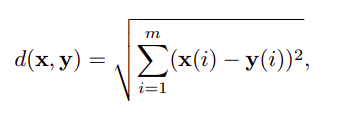

# Agrupamento de espaçamento máximo com MST

# Resumo

## Entrada
- Conjuntos de pontos num espaço m-dimensional
  
    `{X1, . . . , Xn}`
- k -> Número de grupos a serem formados 
  
    `1 <= k <= n`

## Regras
-   Grupos não podem ser vazios
-   Grupos não podem ter elementos em comum
-   Nenhum elemento pode ficar do agrupamento
-   A distancia mínima entre elementos de grupos diferentes devem ser a maior possível

## Saída

- Os grupos C1, . . . ,Ck

# Algoritmos a serem usados

## Distancia Euclidiana

  

## Algoritmo chave (agrupamento)

  - Obtenha as distancias entre todos os pares de pontos. Você pode, por exemplo, armazenar esses valores em uma matriz Y, onde Y(i, j) = d(Xi, Xj).
  - Podemos pensar que a matriz Y descreve um grafo G completo, nao-direcionado e ponderado cujo conjunto de vertices é V = {1, . . , n}, onde o peso de uma aresta {i, j} eé Y(i, j). Assim, o segundo passo do algoritmo e computar a árvore geradora mínima de G usando o famoso Algoritmo de Kruskal
    
    Uma arvore geradora mínima (minimum spanning tree - MST) é um subconjunto de arestas de um grafo não-direcionado conexo e ponderado (isto é, com peso nas arestas). Por ser uma árvore, uma MST não pode ter ciclos. Por ser mínima, a soma dos pesos das arestas tem de ser a menor possível.

  - Remova as k − 1 arestas de maior peso da árvore geradora mínima. As k componentes conexas restantes formam o resultado esperado. 